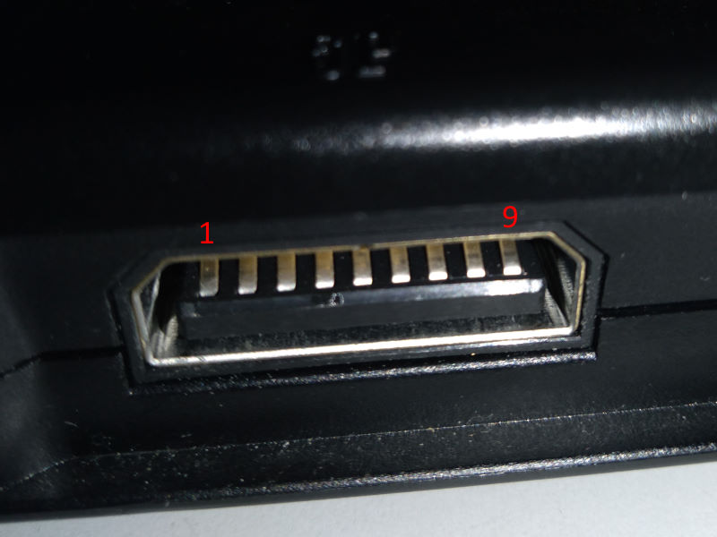
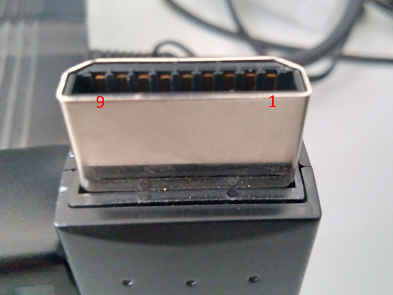

# SaturnLib
Sega Saturn input library for Arduino.

## About

Many years ago I used saturn controllers and multitaps with a adapter on the parallel port.
It's not feasible to connect them this way anymore.

With my great desire to use continue to use the controllers I started to learn C and Arduino.

I hope it's useful to you as it's useful for me. :)

This is an evolution of my [previous project](https://github.com/sonik-br/SaturnMultiUSB).

Now it's written as a class and have customizable arduino pins.

If you see something wrong or something that can be better please let me know.

## Controller compatibility

It's been tested and confirmed to work with:

| Saturn        | Notes                   |
|---------------|-------------------------|
| Digital Pad   |                         |
| 3D Analog Pad | Digital and analog mode |
| Arcade Stick  |                         |
| Twin Stick    |                         |
| Arcade Racer  |                         |
| Multitap      |                         |

| MegaDrive       | Notes                 |
|-----------------|-----------------------|
| 3-Button Pad    |                       |
| 6-Button Pad    |                       |
| 8bitdo M30 2.4G | Can use extra button  |
| Sega Multitap   | Model MK-1647         |

MegaDrive controllers can be connected directly to the arduino or through a saturn multitap.

As Saturn input port is not a standard DB9 it will require a simple adapter to connect MegaDrive controllers. [See below](#MegaDrive-to-Saturn-pin-mapping).

It does not support:
* EA's Multitap
* Saturn/MegaDrive Mouse

## How to use
Saturn and MegaDrive controllers works with 5V so I recommend to use a 5V Arduino.

Each saturn controller port requires 7 data pins plus VCC and GND.

This library requires [DigitalIO](https://github.com/greiman/DigitalIO).

I recommend the usage of [SukkoPera's fork of DigitalIO](https://github.com/SukkoPera/DigitalIO) as it supports a few more platforms.

Sample sketches requires uses [ArduinoJoystickLibrary](https://github.com/MHeironimus/ArduinoJoystickLibrary).

Install the library on your Arduino library folder. Also install the required dependencies.

Then open any of the provided [sketches](sketches).

### Saturn port pins

| Saturn  | Description |
|---------|-------------|
| 1       | VCC/POWER   |
| 2       | D1/DATA 1   |
| 3       | D0/DATA 0   |
| 4       | S0/SEL/TH   |
| 5       | S1/REQ/TR   |
| 6       | S2/ACK/TL   |
| 7       | D3/DATA 3   |
| 8       | D2/DATA 2   |
| 9       | GROUND      |

#### MegaDrive to Saturn pin mapping

| Saturn  | Mega DB9 | Description |
|---------|----------|-------------|
| 1       | 5        | VCC/POWER   |
| 2       | 2        | D1/DATA 1   |
| 3       | 1        | D0/DATA 0   |
| 4       | 7        | S0/SEL/TH   |
| 5       | 9        | S1/REQ/TR   |
| 6       | 6        | S2/ACK/TL   |
| 7       | 4        | D3/DATA 3   |
| 8       | 3        | D2/DATA 2   |
| 9       | 8        | GROUND      |

## Credits

My father for helping with the electronics stuff.

Inspired by raphnet's [saturn_usb](https://github.com/raphnet/saturn_usb).

Darthcloud's [Evolution of SEGA's IO Interface](https://hackaday.io/project/170365-blueretro/log/180790-evolution-of-segas-io-interface-from-sg-1000-to-saturn) article was an essential read to understand the protocol.

It uses the [DigitalIO](https://github.com/greiman/DigitalIO) from greiman.

I recommend the usage of [SukkoPera's fork of DigitalIO](https://github.com/SukkoPera/DigitalIO) as it supports a few more platforms.

## Warning
Code and wiring directions are provided to you 'as is' and without any warranties. Use at your own risk.
